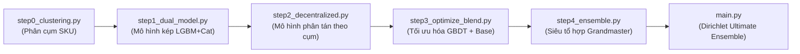

# 🐧 HBAAC 2026 - Champion Ensemble V22 Reproducer

<p align="center">
  
  
  
  
</p>

Đây là mã nguồn hoàn chỉnh của tôi dùng để huấn luyện, tối ưu hóa và tái lập chính xác 100% file nộp bài **`submission_v22_ultimate_ensemble.csv`** từ con số 0 phục vụ cho giải đấu HBAAC 2026.

Quy trình được tôi đóng gói và tái cấu trúc dưới dạng các mô-đun tuần tự, tinh gọn và có khả năng **tự động hóa hoàn toàn với đường dẫn động (Dynamic Path Resolution)**, đảm bảo có thể khởi chạy ngay lập tức trên mọi hệ thống mà không cần cấu hình thủ công.

---

## 📂 1. Kiến Trúc Pipeline & Các Bước Thực Thi

Hệ thống được thiết kế chạy tuần tự qua 5 bước được đánh số rõ ràng để dễ kiểm soát và thực thi độc lập:



### 📋 Chi tiết vai trò từng mô-đun:

| Tệp tin                   | Vai trò chính của tôi                                                                             | Định dạng đầu ra                       |
| :------------------------ | :------------------------------------------------------------------------------------------------ | :------------------------------------- |
| `step0_clustering.py`     | Phân cụm chuỗi thời gian K-Means (K=3) dựa trên mức độ thưa (sparsity) và tỷ lệ hoàn trả.         | `data/sku_clustering_3_groups.csv`     |
| `step1_dual_model.py`     | Huấn luyện mô hình kép (LightGBM + CatBoost) kết hợp các đặc trưng lag nâng cao.                  | `data/sub_dual_model.csv`              |
| `step2_decentralized.py`  | Huấn luyện phân tán theo cụm SKU để tối ưu hóa đặc biệt nhóm thưa và superstars.                  | `data/sub_decentralized.csv`           |
| `step3_optimize_blend.py` | Quét lưới (Grid Search) tối ưu hóa trọng số kết hợp giữa GBDT kép và baseline tham chiếu.         | `data/sub_optimized_blend.csv`         |
| `step4_ensemble.py`       | Siêu tổ hợp (Blender) kết hợp các mô hình thành phần tốt nhất với trọng số tối ưu.                | `data/sub_grandmaster_blend.csv`       |
| `main.py`                 | **Nhạc trưởng điều phối toàn bộ quy trình** và chạy tìm kiếm Dirichlet để sinh kết quả cuối cùng. | `submission_v22_ultimate_ensemble.csv` |

---

## 🛠️ 2. Yêu Cầu Môi Trường & Cài Đặt

### 📦 Các thư viện cần cài đặt:
Chạy lệnh dưới đây để cài đặt đầy đủ các thư viện cần thiết:
```bash
pip install pandas numpy scikit-learn lightgbm catboost
```

### 🗃️ Cấu hình Dữ liệu (Hệ thống tự động nhận diện):
Tôi đã lập trình cơ chế định vị dữ liệu thông minh hỗ trợ 2 cách thiết lập thư mục:

* **Chế độ A: Chạy trong Không gian làm việc (Workspace Mode)**
  Đặt thư mục `reproduce_v22` nằm chung cấp với thư mục `data/` gốc của dự án:
  ```text
  Penguins/
  ├── data/                 <-- Thư mục gốc chứa train.csv, sample_submission.csv,...
  └── reproduce_v22/        <-- Thư mục chứa mã nguồn này
  ```
  *Hệ thống sẽ tự động liên kết giật lùi (fallback) ra thư mục `../data/` ở cấp cha.*

* **Chế độ B: Chạy Độc lập Hoàn toàn (Standalone Mode)**
  Chỉ cần sao chép thư mục `reproduce_v22` và tạo thư mục `data/` chứa dữ liệu ngay bên trong:
  ```text
  reproduce_v22/
  ├── data/                 <-- Chứa train.csv, sample_submission.csv,...
  ├── main.py
  ├── step0_clustering.py
  ...
  ```

---

## 🚀 3. Hướng Dẫn Khởi Chạy

### 🌟 Chạy tự động toàn bộ quy trình từ A - Z
Để tự động thực thi tất cả các bước huấn luyện và sinh ra file kết quả tối ưu:

* **Chạy từ thư mục gốc dự án (`Penguins`):**
  ```powershell
  python reproduce_v22/main.py
  ```
* **Chạy từ bên trong thư mục `reproduce_v22`:**
  ```powershell
  cd reproduce_v22
  python main.py
  ```

> [!NOTE]
> Nhạc trưởng `main.py` sẽ tự động kích hoạt tuần tự từ `step0` đến `step4` và báo cáo chính xác thời gian hoàn thành của mỗi giai đoạn.

---

## 📊 4. Chạy Độc Lập Để Thử Nghiệm

Mã nguồn được tôi thiết kế mô-đun hóa độc lập. Từng bước con dưới đây có thể khởi chạy trực tiếp để kiểm tra hoặc tinh chỉnh tham số:

```powershell
# Thực hiện phân cụm SKUs
python reproduce_v22/step0_clustering.py

# Huấn luyện mô hình kép
python reproduce_v22/step1_dual_model.py

# Huấn luyện phân tán theo cụm
python reproduce_v22/step2_decentralized.py

# Tìm kiếm lưới trọng số blend tối ưu
python reproduce_v22/step3_optimize_blend.py

# Chạy siêu blender tổ hợp
python reproduce_v22/step4_ensemble.py
```

> [!TIP]
> Mỗi tập lệnh khi chạy độc lập đều tự động tải dữ liệu từ cache được tối ưu hóa để tăng tốc độ thực thi.

---

## 🏆 5. Quản Lý Đầu Ra (Outputs)

Sau khi hoàn tất, tệp tin nộp bài chính xác **`submission_v22_ultimate_ensemble.csv`** sẽ được tự động ghi nhận và lưu đồng thời ở hai nơi:
1. 📂 **Toàn cục**: Trong thư mục `data/` chính của dự án.
2. 📂 **Cục bộ**: Ngay tại thư mục `reproduce_v22/` để dễ dàng sao lưu hoặc gửi đi.

> [!IMPORTANT]
> Toàn bộ quá trình đảm bảo tính tái lập 100% (100% Reproducibility) nhờ việc tôi đã cố định các hạt giống ngẫu nhiên (`SEED = 2026` cho mô hình và `seed=42` cho Dirichlet).

---

<p align="center">
  <b>Tác giả: Penguins Team</b> 🐧🏆
</p>
