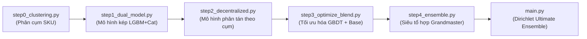

# 🐧 The Penguins - HBAAC 2026

<p align="center">
  
  
  
  
</p>

Đây là mã nguồn hoàn chỉnh của tôi dùng để huấn luyện, tối ưu hóa và tái lập chính xác 100% file nộp bài **`v22_final_ultimate_ensemble.csv`** từ con số 0 phục vụ cho giải đấu HBAAC 2026.

Quy trình được tôi đóng gói và tái cấu trúc dưới dạng các mô-đun tuần tự, tinh gọn và có khả năng **tự động hóa hoàn toàn với đường dẫn động (Dynamic Path Resolution)**, đảm bảo có thể khởi chạy ngay lập tức trên mọi hệ thống mà không cần cấu hình thủ công.

---

## 📂 1. Kiến Trúc Pipeline & Các Bước Thực Thi

Hệ thống được thiết kế chạy tuần tự qua 5 bước được đánh số rõ ràng để dễ kiểm soát và thực thi độc lập:



### 📋 Chi tiết vai trò từng mô-đun:

| Tệp tin                   | Vai trò chính của tôi                                                                             | Định dạng đầu ra                        |
| :------------------------ | :------------------------------------------------------------------------------------------------ | :-------------------------------------- |
| `step0_clustering.py`     | Phân cụm chuỗi thời gian K-Means (K=3) dựa trên mức độ thưa (sparsity) và tỷ lệ hoàn trả.         | `data/sku_clustering_3_groups.csv`      |
| `step1_dual_model.py`     | Huấn luyện mô hình kép (LightGBM + CatBoost) kết hợp các đặc trưng lag nâng cao.                  | `data/v22_stage1_dual_model.csv`        |
| `step2_decentralized.py`  | Huấn luyện phân tán theo cụm SKU để tối ưu hóa đặc biệt nhóm thưa và superstars.                  | `data/v22_stage2_decentralized.csv`     |
| `step3_optimize_blend.py` | Quét lưới (Grid Search) tối ưu hóa trọng số kết hợp giữa GBDT kép và baseline tham chiếu.         | `data/v22_stage3_optimized_blend.csv`   |
| `step4_ensemble.py`       | Siêu tổ hợp (Blender) kết hợp các mô hình thành phần tốt nhất với trọng số tối ưu.                | `data/v22_stage4_grandmaster_blend.csv` |
| `main.py`                 | **Nhạc trưởng điều phối toàn bộ quy trình** và chạy tìm kiếm Dirichlet để sinh kết quả cuối cùng. | `v22_final_ultimate_ensemble.csv`       |

### 📁 1.2 Cấu trúc Thư mục Chi tiết (Workspace Directory Structure):

```text
The Penguins/                           <-- Thư mục gốc không gian làm việc
├── data/                               <-- Chứa dữ liệu đầu vào và các file kết quả trung gian/cuối cùng
│   ├── train.csv
│   ├── sample_submission.csv
│   ├── baseline_submission.csv         <-- File baseline từ mẫu tham chiếu
│   ├── historical_cpi.csv              <-- Chỉ số giá tiêu dùng CPI lịch sử
│   ├── historical_weather.csv          <-- Dữ liệu thời tiết lịch sử
│   ├── wti_oil_prices_clean.csv        <-- Giá dầu WTI lịch sử phục vụ sinh đặc trưng
│   ├── local_scorer_cache.npz          <-- Cache bộ dữ liệu chấm điểm cục bộ nhanh (tự động sinh)
│   ├── sku_clustering_3_groups.csv     <-- Kết quả phân cụm SKU từ step0
│   ├── v22_stage1_dual_model.csv       <-- Kết quả GBDT kép từ step1
│   ├── v22_stage2_decentralized.csv    <-- Kết quả mô hình phi tập trung từ step2
│   ├── v22_stage3_optimized_blend.csv  <-- Kết quả tối ưu hóa V7 Blend từ step3
│   ├── v22_stage4_grandmaster_blend.csv<-- Kết quả Blender tổ hợp v18 từ step4
│   └── v22_final_ultimate_ensemble.csv <-- Kết quả Ultimate Ensemble Dirichlet cuối cùng
├── utils_features.py                   <-- Hàm tiện ích xử lý lag & đặc trưng chuỗi thời gian nâng cao
├── utils_scorer.py                     <-- Trình chấm điểm Flat WRMSSE cục bộ (Local Scorer)
├── EDA_Descriptive_Analysis.ipynb      <-- Notebook phân tích khám phá dữ liệu (EDA) chi tiết
├── step0_clustering.py                 <-- [Bước 0] Phân cụm chuỗi thời gian SKUs bằng K-Means
├── step1_dual_model.py                 <-- [Bước 1] Huấn luyện mô hình kép LGBM & CatBoost
├── step2_decentralized.py              <-- [Bước 2] Huấn luyện phi tập trung theo cụm SKU
├── step3_optimize_blend.py             <-- [Bước 3] Tối ưu hóa trọng số Grid Search GBDT & Baseline
├── step4_ensemble.py                   <-- [Bước 4] Blending siêu tổ hợp Grandmaster
├── main.py                             <-- [Master] Nhạc trưởng điều phối toàn bộ quy trình từ A - Z
└── README.md                           <-- Hướng dẫn này
```

---

## 🛠️ 2. Yêu Cầu Môi Trường & Cài Đặt

### 📦 Các thư viện cần cài đặt:

* **Cho Pipeline huấn luyện chính (chạy các file script `.py`):**
  Chạy lệnh dưới đây để cài đặt đầy đủ các thư viện cốt lõi:

```bash
pip install pandas numpy scikit-learn lightgbm catboost
```

* **Cho tệp Phân tích Khám phá Dữ liệu (`EDA_Descriptive_Analysis.ipynb`):**
  Notebook này sử dụng thêm thư viện vẽ biểu đồ và môi trường chạy Jupyter. Để khởi chạy, bạn cần cài đặt:

```bash
pip install matplotlib jupyter
```
  *(Lưu ý: Bạn cũng có thể mở trực tiếp và khởi chạy notebook này trên phần mềm **VS Code** nếu đã cài đặt **Jupyter Extension**).*

### 🗃️ Cấu hình Dữ liệu:
Hệ thống tự động nhận diện thư mục dữ liệu `data/` cục bộ mà không cần bất kỳ cấu hình thủ công nào.

---

## 🚀 3. Hướng Dẫn Khởi Chạy

### 🌟 Chạy tự động toàn bộ quy trình từ A - Z
Để tự động thực thi tất cả các bước huấn luyện và sinh ra file kết quả tối ưu:

* **Chạy trực tiếp từ thư mục gốc (`The Penguins`):**

```powershell
python main.py
```

> [!NOTE]
> Nhạc trưởng `main.py` sẽ tự động kích hoạt tuần tự từ `step0` đến `step4` và báo cáo chính xác thời gian hoàn thành của mỗi giai đoạn.

---

## 📊 4. Chạy Độc Lập Để Thử Nghiệm

Mã nguồn được thiết kế mô-đun hóa độc lập. Từng bước con dưới đây có thể khởi chạy trực tiếp tại thư mục gốc `The Penguins` để kiểm tra hoặc tinh chỉnh tham số:

```powershell
# Thực hiện phân cụm SKUs
python step0_clustering.py

# Huấn luyện mô hình kép
python step1_dual_model.py

# Huấn luyện phân tán theo cụm
python step2_decentralized.py

# Tìm kiếm lưới trọng số blend tối ưu
python step3_optimize_blend.py

# Chạy siêu blender tổ hợp
python step4_ensemble.py
```

> [!TIP]
> Mỗi tập lệnh khi chạy độc lập đều tự động tải dữ liệu từ cache được tối ưu hóa để tăng tốc độ thực thi.

---

## 🏆 5. Quản Lý Đầu Ra (Outputs)

Sau khi hoàn tất, tệp tin nộp bài chính xác **`v22_final_ultimate_ensemble.csv`** sẽ được tự động ghi nhận và lưu đồng thời ở hai nơi:
1. 📂 **Toàn cục**: Trong thư mục `data/` chính của dự án.
2. 📂 **Cục bộ**: Ngay tại thư mục gốc `The Penguins/` để dễ dàng sao lưu hoặc gửi đi.

> [!IMPORTANT]
> Toàn bộ quá trình đảm bảo tính tái lập 100% (100% Reproducibility) nhờ việc hạt giống ngẫu nhiên đã được cố định (`SEED = 2026` cho mô hình và `seed=42` cho Dirichlet).

---

<p align="center">
  <b>Tác giả: Penguins Team</b> 🐧🏆
</p>
